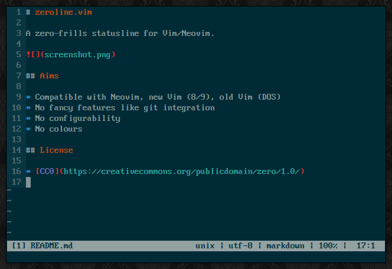

# zeroline.vim

A zero-frills statusline for Vim/Neovim.

## Aims

* Compatible with Neovim, new Vim (8/9), old Vim (DOS)
* No fancy features like git integration
* No configurability
* No colours

## License

* [CC0](https://creativecommons.org/publicdomain/zero/1.0/)

